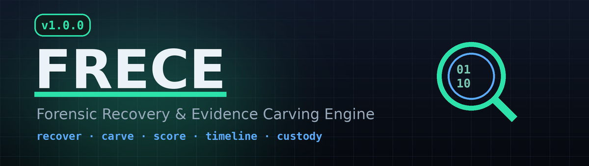

<p align="center">
  
</p>

# FRECE — Forensic Recovery and Evidence Carving Engine

> Production-grade CLI forensic platform for evidence recovery, file carving,
> chain-of-custody, timeline analysis, and threat-intelligence scanning.

[](https://github.com/Nakum-hub/frece/actions)
[](https://python.org)
[](LICENSE)
[](CHANGELOG.md)
[](tests/)

> ⚠️ **Proprietary software — All Rights Reserved.** FRECE is the proprietary property of Nakum-hub. No use, copying, modification, or distribution is permitted without the prior written permission of the owner. See [LICENSE](LICENSE) for the full terms and [contact the owner](https://github.com/Nakum-hub/frece) for commercial licensing.

---

## What is FRECE?

FRECE is a complete command-line digital forensics platform that helps investigators,
incident-response teams, and forensic laboratories:

- **Recover** deleted files from NTFS, ext2/3/4, FAT32 disk images
- **Rescue** files from the desktop Trash/recycle bin on **Linux, Windows (`$Recycle.Bin`) and macOS** — list them with their original path and deletion time, then restore (`frece trash`)
- **Carve** 88 file types from raw/unallocated binary data
- **Extract** deep forensic metadata (EXIF GPS, PE timestamps, SQLite tables, PCAP IPs)
- **Score** every artifact with a 0–100 confidence grade (CONFIRMED / PROBABLE / POSSIBLE)
- **Detect** encrypted and high-entropy files automatically
- **Scan** with YARA rules for threat intelligence inline at carve time
- **Build** MAC-time forensic timelines from all case artifacts
- **Generate** court-admissible DFXML reports and HTML case summaries
- **Protect** chain-of-custody with HMAC-signed databases and AES-256-GCM encryption

---

## Why FRECE?

| Capability | PhotoRec | Foremost | Scalpel | **FRECE** |
|---|:---:|:---:|:---:|:---:|
| File carving (88 types) | ✅ | ✅ | ✅ | ✅ |
| Trash recovery (Linux/Windows/macOS) | ❌ | ❌ | ❌ | ✅ |
| Exact carved-file size | ⚠️ | ❌ | ❌ | ✅ |
| Structural validation per type | ❌ | ❌ | ❌ | ✅ 46 types |
| Confidence scoring (0–100) | ❌ | ❌ | ❌ | ✅ |
| Deep metadata extraction | ❌ | ❌ | ❌ | ✅ 12 types |
| YARA rule scanning at carve time | ❌ | ❌ | ❌ | ✅ |
| E01/EWF image format support | ❌ | ❌ | ❌ | ✅ |
| DFXML court-admissible output | ❌ | ❌ | ❌ | ✅ |
| HMAC chain-of-custody | ❌ | ❌ | ❌ | ✅ |
| AES-256-GCM DB encryption | ❌ | ❌ | ❌ | ✅ |
| MAC-time timeline synthesis | ❌ | ❌ | ❌ | ✅ |
| Entropy / encryption detection | ❌ | ❌ | ❌ | ✅ |
| Orphan filename suggestion | ❌ | ❌ | ❌ | ✅ |
| Forensic triage priority | ❌ | ❌ | ❌ | ✅ |
| JSON / CSV / HTML / DFXML output | ❌ | ❌ | ❌ | ✅ |

---

## Installation

> **Note:** FRECE is proprietary software. Installation and use require a license or the prior written permission of the owner (see [LICENSE](LICENSE)).

### One command (recommended)

This is the fastest way. The installer pulls in the system forensic tools FRECE
needs (**The Sleuth Kit, ewf-tools, libmagic, YARA**) **and** installs the `frece`
CLI itself — in a single step:

```bash
curl -fsSL https://raw.githubusercontent.com/Nakum-hub/frece/main/install.sh | sudo bash
```

That's it. Open a new terminal and run `frece --version`.

> **Why an installer instead of plain `pip install frece`?**
> FRECE depends on command-line forensic tools (`fls`, `icat`, `mmls`, …) that
> live **outside** Python and can only be installed by your OS package manager —
> `pip` can never install them. On top of that, modern systems such as **Kali**
> and Debian 12+ block `pip install` into the system Python (the
> `externally-managed-environment` error, [PEP 668](https://peps.python.org/pep-0668/)).
> The installer handles both problems for you: it installs the system tools with
> `apt`/`dnf`/`pacman`, then installs FRECE into an **isolated environment** via
> [`pipx`](https://pipx.pypa.io/) so it never collides with system packages.

### Install from a local clone

If you prefer to inspect the code first, clone the repo and run the same script:

```bash
git clone https://github.com/Nakum-hub/frece.git
cd frece
sudo ./install.sh
```

### Manual install (if you'd rather do it yourself)

```bash
# 1. System prerequisites (cannot be installed by pip)
sudo apt-get update
sudo apt-get install -y sleuthkit ewf-tools libmagic1 yara python3 python3-venv pipx git

# 2. Install FRECE in an isolated environment (PEP 668-safe)
pipx ensurepath
pipx install git+https://github.com/Nakum-hub/frece.git
```

### Verify

```bash
frece --version        # 1.0.0
frece tool-status      # checks all required external tools are present
```

### Troubleshooting: `error: externally-managed-environment`

If you ran `pip install frece` on Kali/Debian/Ubuntu and saw this:

```
error: externally-managed-environment
× This environment is externally managed
```

…that's [PEP 668](https://peps.python.org/pep-0668/) protecting your system
Python — it is **not** a bug in FRECE. Don't use `--break-system-packages`; it
can corrupt OS-managed packages. Instead, use the isolated install above:

```bash
# easiest — re-run the one-command installer:
curl -fsSL https://raw.githubusercontent.com/Nakum-hub/frece/main/install.sh | sudo bash

# or install just the CLI in isolation with pipx:
pipx install git+https://github.com/Nakum-hub/frece.git
```

If `frece` isn't found after installing, your shell hasn't picked up
`~/.local/bin` yet — start a new terminal or run:

```bash
export PATH="$HOME/.local/bin:$PATH"
```

### Uninstall

```bash
pipx uninstall frece
```

---

## Quick Start

```bash
# Set up secure key storage (recommended)
export FRECE_KEY_STORE=/secure/partition/frece-keys

# Create a case
frece case create CASE-2025-001

# Hash the evidence before any operation
frece hash /dev/sda --algorithms sha256,sha512
# or for E01 images:
frece hash evidence.E01 --algorithms sha256

# Log the acquisition
frece case log CASE-2025-001 ACQUIRE \
    --evidence-id EV-001 \
    --detail "source=/dev/sda" \
    --operator "j.smith"

# Scan for deleted files
frece scan evidence.dd

# Recover deleted files
frece recover evidence.dd --output ./recovered

# Recover files sitting in the desktop Trash / recycle bin
frece trash list                                  # list trashed files + original paths
frece trash recover --all --output ./from-trash   # forensic copy out of the Trash

# Carve from raw/unallocated space
frece carve evidence.dd --output ./carved

# Carve with YARA threat scanning
frece carve evidence.dd --output ./carved --yara-rules ./rules/

# Extract deep metadata from artifacts
frece metadata ./carved

# Score all carved artifacts (0-100 confidence)
frece score ./carved/carve_manifest.json

# Build a MAC-time forensic timeline
frece timeline CASE-2025-001 --format text

# Search recovered evidence
frece search ./recovered --keyword "password"
frece search ./recovered --keyword "\d{3}-\d{2}-\d{4}" --regex  # SSN

# Detect encrypted files
frece entropy ./carved --threshold 7.0

# Classify by forensic category
frece classify ./recovered --priority HIGH

# Generate HTML report
frece report CASE-2025-001 --format html --output report.html

# Generate court-admissible DFXML
frece report CASE-2025-001 --format dfxml --output report.dfxml

# Encrypt custody database at rest (enterprise)
frece custody encrypt /path/to/CASE-2025-001 --passphrase "your-passphrase"

# Verify chain of custody
frece case verify CASE-2025-001
```

---

## All Commands

```
frece tool-status                   Check all required tools
frece --version                     Show version

Evidence Acquisition:
  frece acquire <source> --output   Acquire evidence with write-block check
  frece hash <file>                 Compute SHA-256/SHA-512/MD5/BLAKE2b

Case Management:
  frece case create <name>          Create a new investigation case
  frece case log <name> <event>     Log a custody event (ACQUIRE, EXAMINE, …)
  frece case verify <name>          Verify HMAC chain-of-custody integrity
  frece case rotate-key <name>      Rotate HMAC secret key
  frece custody verify <dir>        Verify a case directory
  frece custody encrypt <dir>       AES-256-GCM encrypt custody.db at rest
  frece custody decrypt <file>      Decrypt a custody.db.enc file

File System Analysis:
  frece scan <image>                List deleted files (fls-based)
  frece scan <image> --mactime      List with MAC timestamps
  frece partitions <image>          Show partition table (mmls)
  frece fsstat <image>              Filesystem metadata and statistics

Recovery & Carving:
  frece recover <image>             Recover deleted files with icat
  frece carve <image>               Carve 88 file types from raw/unallocated
  frece carve <image> --yara-rules  Carve with inline YARA threat scanning
  frece carve <image> --progress    Show real-time ETA + throughput

Trash / Recycle Bin Recovery:
  frece trash list                  List files in the desktop Trash (+ original path, deletion time)
  frece trash list --path <dir>     Inspect a specific Trash dir, mounted image, or user home
  frece trash recover --all         Recover every trashed file (forensic copy to --output)
  frece trash recover --name <n>    Recover a specific trashed item
  frece trash recover --to-original Restore items in place to their original location

Forensic Analysis:
  frece metadata <file|dir>         Deep metadata (EXIF GPS, PE ts, SQLite tables…)
  frece score <manifest>            0-100 confidence scores with grade breakdown
  frece entropy <file|dir>          Shannon entropy + encryption detection
  frece classify <dir>              Forensic category + CRITICAL/HIGH triage
  frece search <dir> --keyword      Keyword / regex search in artifacts
  frece timeline <case>             MAC-time forensic timeline (text/CSV/JSON)

Reporting:
  frece report <case> --format json    Full JSON case report
  frece report <case> --format text    Human-readable text with bar charts
  frece report <case> --format html    Dark-theme HTML for presentation
  frece report <case> --format dfxml   Court-admissible DFXML XML
```

---

## Carving — Supported File Types (88 signatures)

| Category | Types |
|---|---|
| Images | JPEG, PNG, GIF, BMP, TIFF, PSD, WebP, HEIC/HEIF |
| Documents | PDF, RTF, XML, HTML |
| Office | DOCX, XLSX, PPTX, DOC, XLS, PPT, MSG (OLE compound) |
| Archives | ZIP, 7z, RAR 4.x/5.x, GZ, BZ2, XZ, Zstandard, LZ4 |
| Audio | MP3, WAV, FLAC, OGG, AIFF, APE, AMR |
| Video | MP4, MOV, AVI, MKV/WebM, FLV |
| Executables | PE (EXE/DLL/SYS), ELF, Mach-O (macOS), scripts |
| Windows artifacts | EVTX, LNK, Registry hive, Prefetch, $MFT, $INDEX |
| Databases | SQLite, MDB (Access) |
| Network | PCAP, PCAPng |
| Email | EML, mbox |
| Crypto | PEM certificates/keys, Bitcoin wallet hints |
| Virtual disks | VMDK, VHD, VHDX, QCOW2, VDI |
| Mobile/Apple | HEIC, binary plist, Mach-O fat binary |
| System | Windows Minidump, hiberfil.sys, DER certificates |

---

## Forensic Metadata Extraction (`frece metadata`)

| File Type | Extracted Fields |
|---|---|
| JPEG | EXIF GPS (latitude/longitude/altitude), camera make/model, datetime original |
| PNG | Width, height, bit depth, `tEXt` author/timestamp/GPS, DPI |
| PDF | Author, title, creator, version, creation date, encryption flag |
| PE | Compile timestamp, architecture (x86/x64/ARM64), EXE/DLL/SYS, subsystem |
| ELF | Architecture, ABI, type (executable/shared/core), build-ID |
| SQLite | Table names, row counts, column names, schema version, page size |
| PCAP | Packet count, unique src/dst IPs, protocols (TCP/UDP/ICMP), timestamps |
| EML | From, To, CC, Subject, Date, Message-ID, attachment names |
| LNK | Target path, drive type, volume serial, creation/access/write times |
| EVTX | Record count estimate, dirty/full flags |
| ZIP/DOCX/XLSX/PPTX | File listing, Office author/title/creation date |
| RTF | Author, company, creation date |

---

## Confidence Scoring (`frece score`)

Every carved and recovered artifact receives a 0–100 confidence score:

| Grade | Range | Meaning |
|---|---|---|
| **CONFIRMED** | 90–100 | Court-presentable, all checks passed |
| **PROBABLE** | 75–89 | Strong evidence, minor anomalies |
| **POSSIBLE** | 50–74 | Partial evidence, manual review recommended |
| **SUSPECT** | 25–49 | Structural issues, low reliability |
| **REJECTED** | 0–24 | Likely false positive, do not present |

Four scored dimensions: structural integrity (header/footer), entropy plausibility,
size plausibility, and metadata presence.

---

## Supported Image Formats

| Format | Extension | Support |
|---|---|---|
| Raw disk image | `.dd`, `.img`, `.bin`, `.raw` | Native |
| EnCase EWF | `.E01`, `.Ex01`, `.E01x` | Via ewf-tools |
| Smart/Solo EWF | `.S01` | Via ewf-tools |
| AFF | `.aff`, `.afd`, `.afm` | Via ewf-tools |

---

## Chain of Custody

FRECE uses HMAC-SHA256 to create a tamper-evident audit log:

```bash
# Verify integrity at any time
frece case verify CASE-2025-001

# Encrypt the custody database at rest (enterprise compliance)
export FRECE_KEY_STORE=/encrypted/partition/frece-keys
frece custody encrypt /path/to/case --passphrase "strong-passphrase"
```

DFXML output embeds all custody information in a court-accepted XML format.

---

## Trash / Recycle-Bin Recovery (`frece trash`)

Deleting a file in a desktop file manager does **not** erase it — it is moved into
a per-platform trash store. `frece trash` understands all three common layouts and
recovers from each, reporting the **original path, deletion time, size, SHA-256,
and type** for every entry:

| Platform | Location | Original path & deletion time |
|---|---|---|
| **Linux** (freedesktop) | `~/.local/share/Trash`, `.Trash-<uid>` | ✅ from `*.trashinfo` |
| **Windows** | `$Recycle.Bin\<SID>\` (`$I`/`$R` pairs) | ✅ from the `$I` record (FILETIME) |
| **macOS** | `~/.Trash`, `.Trashes/<uid>` | deletion time from file mtime |

```bash
# Auto-discover trashes on the local machine (home + mounted volumes)
frece trash list

# Analyse a MOUNTED EVIDENCE IMAGE — point --path at the mounted root, a user's
# home, a Windows $Recycle.Bin\<SID>, or a macOS .Trash
frece trash list --path /mnt/evidence
frece trash list --path "/mnt/win/$Recycle.Bin/S-1-5-21-1234567890-1001"
frece trash list --path /mnt/mac/Users/alice/.Trash

# Save the listing as a JSON report
frece trash list --path /mnt/evidence --output trash_report.json

# Recover everything to a folder — forensic copy, the trash is left intact
frece trash recover --path /mnt/evidence --all --output ./from-trash

# Recover one item, or restore items to their original location (same-OS)
frece trash recover --name "report.pdf" --output ./from-trash
frece trash recover --all --to-original
```

For files that were *emptied* from the trash, recover them at the filesystem layer
with `frece recover` / `frece scan` (The Sleuth Kit).

---

## Filesystem Behaviour

| Filesystem | Name Recovery on Delete | MAC Timestamps | Notes |
|---|:---:|:---:|---|
| NTFS | ✅ Full | ✅ | Best recovery — `$MFT` entry preserved |
| ext2/3 (no journal) | ✅ Partial | ✅ | Directory entries sometimes survive |
| ext4 (with journal) | ⚠️ Orphan | ✅ | Journal zeroes inode block pointers; use `frece carve` for content |
| FAT32/exFAT | ✅ Partial | ✅ | Via The Sleuth Kit |

---

## Requirements

- Python 3.11+
- The Sleuth Kit (`fls`, `icat`, `istat`, `mmls`, `fsstat`)
- `libmagic` / `python-magic`
- GNU coreutils (`sha256sum`)
- Optional: `ewf-tools` for E01/EWF images
- Optional: `yara` for threat-intelligence scanning

---

## License

**Proprietary — All Rights Reserved.**

Copyright (c) 2025 Nakum-hub. All rights reserved.

FRECE is proprietary and confidential software. **No license is granted** to use,
copy, modify, merge, publish, distribute, sublicense, or sell this software or its
source code without the prior express written permission of the owner. See
[LICENSE](LICENSE) for the complete terms.

For commercial licensing or permission requests, contact the owner through the
project repository: https://github.com/Nakum-hub/frece

Third-party dependency licenses: see [THIRD_PARTY_LICENSES.md](THIRD_PARTY_LICENSES.md)

---

## Changelog

See [CHANGELOG.md](CHANGELOG.md) for the full version history.
